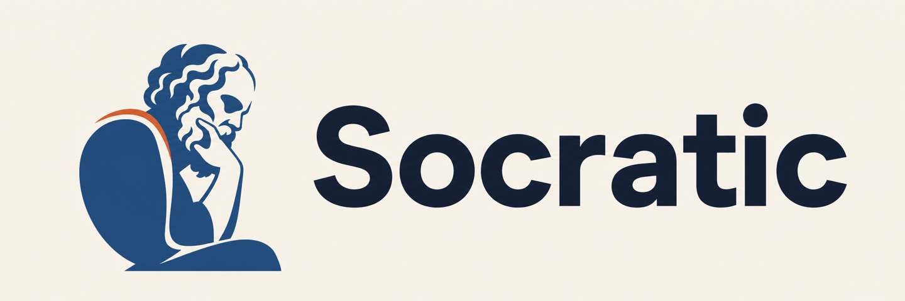

<p align="center">
  
</p>

[Website](https://shogo1222.github.io/socratic/) | English | [日本語](README.ja.md)

# Socratic

[](https://github.com/Shogo1222/socratic/actions/workflows/ci.yml)
[](https://github.com/Shogo1222/socratic/releases)

> Don't review every line. Review the decisions that matter.

Socratic is a set of three Agent Skills that support reviewing AI-generated PRs.

The names come from the Socratic method — recognize what is not yet known and inquire (Socratic), draw ideas out of the other person through dialogue (Maieutic, the art of midwifery), and examine claims by refutation (Elenchus) — and the review follows exactly that sequence.

- **Socratic** — the orchestrator. It compares behavior before and after a change, extracts only the specifications a human must decide, the changes that may be unintended, and the important risks the existing tests cannot detect, and delivers the four-block review surface with copy-ready comment candidates. **Outcome**: instead of reading the whole diff, you review a handful of decisions and paste-ready comments.
- **Maieutic** — the elicitation skill. It converts expectations the implementation alone cannot establish into concrete questions a specification owner can answer, and records the answers in the Intent Contract linked to their tests. **Outcome**: vague unease becomes answerable specification questions and a test-backed record of confirmed intent.
- **Elenchus** — the refutation skill. It runs the same behavior tests against base and head to detect behavior differences and proves the tests' detection ability with mutations. Run standalone, it assesses existing and changed tests (Test Assessment). **Outcome**: not "the tests are green" but proof that injecting the bug actually makes a test fail.

## The problem

When AI writes most of the code, reviewers face:

- diffs too large to scrutinize line by line;
- implementation intent that the code alone cannot establish;
- green tests that may not detect important bugs;
- lingering doubt that a refactoring changed behavior;
- investigation and wording costs for every review comment;
- AI reviewers flooding PRs with low-value comments.

Socratic lets a reviewer grasp four things quickly:

1. what changes from the user's point of view;
2. where a human specification decision is required;
3. which incidents are plausible;
4. whether the tests would actually detect them.

## Installation

Socratic targets Claude Code, Codex, and Cursor. Other agent hosts are not supported by this integration preview.

### Claude Code

For the v0.3.0 integration preview, add the repository as a Claude Code Marketplace and install the Plugin:

```text
/plugin marketplace add Shogo1222/socratic
/plugin install socratic@socratic-marketplace
```

To receive a published version bump, refresh the catalog and update the Plugin:

```text
/plugin marketplace update socratic-marketplace
/plugin update socratic@socratic-marketplace
```

Then start Claude normally in a trusted Git repository and invoke the Marketplace command shown as `/socratic`. The Plugin automatically starts a session-scoped Host broker before Claude processes the request and denies direct Primary writes and unguarded Bash through `PreToolUse`. Direct Maieutic and Elenchus invocation uses the same gate. A `Stop` event preserves the broker while a run manifest exists so human decisions can span turns, then cleans it after finish or abort; an idle TTL and later Host events collect abandoned or stale brokers. No separate launcher command is required.

Review and trust the bundled hook through `/hooks`, then start a new thread. If the hook is untrusted, disabled, or unavailable, do not use Socratic. Plugin-hook trust is user-controlled; an organization that needs an undeletable boundary must deploy the same gate as a managed hook through `requirements.toml` and OS/device management.

### Codex

Add the Codex marketplace, install the Plugin, and review its bundled hooks through `/hooks`:

```bash
codex plugin marketplace add Shogo1222/socratic
codex plugin add socratic@socratic-marketplace

# refresh the Marketplace snapshot before installing a published update
codex plugin marketplace upgrade socratic-marketplace
codex plugin add socratic@socratic-marketplace
```

Invoke `$socratic` in a trusted local Git repository. The Codex Plugin starts the same session-scoped Host broker and denies direct Primary writes and unguarded commands through `PreToolUse`. It preserves active run state across turns and cleans completed, aborted, or idle sessions.

### Cursor Desktop

The repository also contains a native Cursor Plugin under `.cursor-plugin/`. Install it as a local Plugin in Cursor Desktop and reload the window before invoking `$socratic`. The Plugin uses fail-closed `beforeSubmitPrompt`, `preToolUse`, and `beforeShellExecution` hooks. Cursor CLI, remote workspaces, and cloud agents are not supported because their current hook coverage cannot establish the same boundary. Public Cursor Marketplace installation remains unavailable until the Plugin has passed Cursor's separate submission process.

### Standalone Maieutic and Elenchus

Standalone Agent Skills remain available for Maieutic and Elenchus development in Codex or Cursor, but they are not the compliant `$socratic` entrypoint:

```bash
# choose skills and install them for Codex or Cursor interactively
gh skill install Shogo1222/socratic

# install all three skills
gh skill install Shogo1222/socratic --all

# pin standalone resources to an integration-preview release
gh skill install Shogo1222/socratic --all --pin v0.4.0-alpha.12
```

Alternatively, use the Agent Skills CLI and select Codex or Cursor as the target:

```bash
npx skills add Shogo1222/socratic --skill '*'
```

Invoke `$maieutic` or `$elenchus` directly for standalone analysis. Use each Host's Plugin above for the integrated `$socratic` workflow.

The mandatory review runner requires Python 3 with `jsonschema` and `referencing`. Each Host Plugin resolves these dependencies before the agent starts. If they are absent, the Hook creates an isolated virtual environment in the Plugin's writable data directory and installs pinned versions there; it never changes the repository or global Python environment. The first run therefore requires package-index access. Bootstrap failure stops Socratic before the agent runs. Organizations may pre-provision the same pinned dependencies in a managed Python runtime to avoid first-run network access.

For organizational rollout — release verification, preview, and project scope — follow the [enterprise installation guide](docs/enterprise-installation.md).

## Who it is for

- senior engineers and tech leads reviewing AI-generated PRs;
- reviewers who want to know quickly which decisions a large diff actually needs;
- teams that want to check whether AI-added tests really protect anything.

How Socratic positions itself:

- it does not replace review; it prepares the material that lets the reviewer focus on important decisions;
- it never posts to GitHub — it generates copy-ready inline comment candidates, and the reviewer decides what to post, edit, or discard;
- specification questions are answered by the specification owner: the PR author, reviewer, product owner, domain expert, tech lead, or the owner of the API or data;
- when AI generated the code, the AI is neither specification evidence nor an answerer;
- when the reviewer lacks the authority to decide, the comment candidates are their tool for confirming with the owner.

## Use cases

### Feature Review

For a PR that introduces new behavior or changes a specification, extract the expectations the implementation alone cannot establish.

```markdown
Is renewal intended to succeed when the contract end date equals the renewal date?

The expectation at this boundary depends on whether the end date is inside the valid period. The repository does not resolve this, so we would like to confirm the expected behavior.
```

Confirmed specifications are recorded in the Intent Contract and linked to their tests.

### Refactor Guard

For a refactoring that claims to preserve behavior, run the same behavior tests against base and head.

```text
Same behavior test
      |
      +-- run on base
      |
      +-- run on head
      |
      v
Extract the behavior diff
```

When a difference is found, ask a human whether it is an intended change or a regression.

```markdown
This refactoring appears to change the expiry-boundary behavior.

When the contract end date equals the execution date, renewal succeeded before the change and is rejected after it.

If this refactoring is meant to preserve behavior, this may be an unintended change. Is it intended?
```

For Refactor Guard to be trustworthy, comparison tests must verify observable behavior, not internal structure. False positives produced by implementation-coupled tests are never reported as behavior diffs.

### Test Assessment

For evaluating the tests themselves — especially tests an AI just added — run `$elenchus` standalone. It compares the same risk mutations against the existing and changed test suites and separates existing protection, incremental protection, protection regressions, and unprotected risks. See [Run Elenchus independently](#run-elenchus-independently).

## Behavior diff classification

| Base | Head | Classification |
|---|---|---|
| Pass | Pass | the verified behavior is preserved |
| Pass | Fail | existing behavior was changed or removed |
| Fail | Pass | new behavior was added or fixed |
| Fail | Fail | not valid as a comparison test, or not implemented |

Test compile failures, environment errors, timeouts, and flaky failures are never treated as behavior diffs.

`Base pass / head fail` is never automatically a bug. The base is not the specification; it is the behavior observed before the change.

- In a refactor PR, an unintended change is likely.
- In a feature PR, an intended specification change is possible.
- When neither can be established, ask a human.

## Output

The terminal output is fixed to four blocks:

- **Review This** — what needs a human decision: unresolved intent, behavior diffs not yet confirmed as intended, and design risks that need an acceptance decision.
- **We Verified** — what is confirmed: preserved behavior, changes the specification owner confirmed as intended, tests applied to the working tree and proven, tests proposed and proven in a disposable workspace, resolved test gaps, and detection ability proven by mutation.
- **Still at Risk** — what was not verified: unchallenged behavior, execution-environment constraints, nondeterministic processing, and ranges that could not be compared.
- **Copy-ready Comments** — candidates the reviewer can use, with target file, target line, comment body, and internal generation evidence.

Test provenance is always relative to the start of the Socratic run, not to the broader conversation or Git history. Reviewer-facing output identifies each test as **existing at run start**, **proposed and proven in disposable workspace**, or **applied by this run after explicit request**. A Review-only run whose postflight matches preflight also says **Working tree unchanged during this Review-only run**.

When Review-only proves a proposed test, Socratic preserves an exact test-only patch and its hash-validated handoff outside the working tree until you choose **Apply tests**, **Output patch**, or **Discard**. This operational choice appears after the four review blocks. A stale or missing handoff is regenerated and re-proved instead of being forced or described as reused.

Findings route by state, not type:

```text
Behavior diff
  unconfirmed            -> Review This
  confirmed intended     -> We Verified

Test gap
  unresolved                                   -> Review This
  proposed and proven in disposable workspace  -> We Verified
                                                  + Still at Risk: protection not applied yet
  applied to working tree and proven           -> We Verified

Residual risk
  -> Still at Risk
```

An example run:

```text
Socratic Review

Review This:
  ! 1 expiry-boundary behavior difference found

    Before:
      renewal succeeded on the expiry date

    After:
      ExpiredSubscriptionError

    Required decision:
      the specification owner must confirm whether this change is intended

We Verified:
  ✓ duplicate renewal is rejected
  ✓ the renewed expiry date is observable after saving
  ✓ external event payload and emission count
  ✓ 4 boundary tests existing at run start were evaluated
  ✓ the missing-event mutation is detected by a test proposed and proven in disposable workspace
  ✓ Working tree unchanged during this Review-only run

Still at Risk:
  △ timezone boundary
    not verified because the clock cannot be controlled
  △ proposed test not applied yet
    the missing-event protection is not persistent until applied

Copy-ready Comments:
  1 comment for src/subscription.ts:52
```

Merge readiness, confidence levels, and overall scores are never displayed. Socratic reports three things — the verified scope, the findings or decisions, and the unverified scope — and the merge decision stays with the reviewer. The detailed Intent Contract, mutation results, proven-test handoff status, test strategy, and executed commands are kept in temporary run artifacts; after resolving any test handoff, you choose whether to discard the run artifacts (the default), save them locally, or output them as Markdown.

## Copy-ready comments

The primary deliverable is comment candidates the reviewer can copy to GitHub, limited to three kinds:

- `Intent decision`: a specification the implementation cannot establish
- `Behavior difference`: behavior that differs between base and head
- `Test gap`: an important defect the existing tests cannot detect

Each comment has this structure:

1. the observed behavior;
2. the decision or test gap;
3. why the answer is needed;
4. what changes with each answer.

Candidates are limited to one to three as a rule; volumes of minor findings are never generated. Issues that cannot anchor to a line remain under Still at Risk as `Residual risk`.

## Decision prompts

Behavior differences become structured questions the specification owner answers in the host's native UI:

```text
Behavior diff
      ↓
Decision prompt
      ↓
host selection UI (Codex / Claude Code)
      ↓
Intent Contract
      ↓
fixed by tests, challenged by mutation
```

The prompt content is host-neutral: one to three questions per batch, two or three mutually exclusive options each, a one-sentence observable consequence per option, a free-form alternative, and the oracle the answer changes. Only the rendering is host-specific:

- **Claude Code**: `AskUserQuestion`
- **Codex**: `request_user_input`
- **other environments**: the same question as copyable Markdown

Structured questions are asked by the main agent only; subagents investigate, test, and mutate, and return open decisions. Socratic guarantees the question content — the selection UI belongs to the host, so no vendor-specific application is required.

## Test design principles

Grounded in Vladimir Khorikov's *Unit Testing Principles, Practices, and Patterns*, Socratic tests a unit of behavior, not internal structure.

### 1. Start from the client's goal

A class or a method is never the unit under test.

```text
Who uses it?
    ↓
What do they want to achieve?
    ↓
Which operation do they perform?
    ↓
What can they observe as the result?
```

### 2. Classify dependencies before choosing oracles

- **in-process**: domain services, repository abstractions, internal event handlers. Verify the final result a client can observe, not internal communication.
- **out-of-process, managed**: an application-private database or managed file storage. Verify the actual final state with a focused integration test, not repository call counts.
- **out-of-process, unmanaged**: external APIs, SMTP services, a message bus other services subscribe to, payment gateways. Verify message content and count at the application boundary with a mock or spy.

Classification starts from the repository — adapter and gateway implementations, infrastructure configuration, message consumers, database ownership, API specifications, existing tests, and architecture decision records. Only when it cannot be established and the answer changes the oracle does it become a question for the specification owner.

### 3. Oracle priority

```text
output values
  ↓
observable final state
  ↓
communication crossing the application boundary
```

### 4. Do not verify implementation details

Internal method call order, internal class structure, repository call counts, the number of stub reads, intermediate state that does not affect the final result, and algorithms freely replaceable by refactoring are, as a rule, never expectations.

## The four pillars of a good test

Tests are evaluated on four axes: protection against regressions, resistance to refactoring, fast feedback, and maintainability. They are never all maximized at once; the first three trade off against each other.

| Test | Regression protection | Refactoring resistance | Feedback |
|---|---:|---:|---:|
| E2E | high | high | slow |
| Trivial test | low | high | fast |
| Implementation-coupled test | can be high | low | fast |
| Good unit test | medium–high | high | fast |

Socratic keeps resistance to refactoring and distributes the remaining pillars by change risk.

```text
fast behavior tests
        +
a few focused integration tests for important state
        +
even fewer E2E tests for boundary contracts
```

Rather than "always add a unit test", it chooses the test level that protects the risk most cost-effectively.

## The role of mutation testing

Mutation testing is not a feature sold to the user; it is the internal mechanism that backs the detection ability of the tests.

```text
Base      → pass
Head      → pass
Mutant    → fail
```

This proves the tests observe the same behavior on both revisions and actually fail when the target bug is introduced. When existing tests miss a mutation, it is investigated as a test gap:

```text
delete the external event emission
      ↓
existing tests pass
      ↓
add a boundary-contract assertion
      ↓
passes on the original code
      ↓
fails on the same mutation
```

Mutations that preserve observable behavior — deleting an internal method, reordering internal calls — are never forced into detection. Mutation score is never the success criterion.

## Write policy

The default mode is **Review-only**: nothing is written to the PR, GitHub, or the repository working tree.

- no automatic posting to GitHub;
- no changes to head production code;
- comparison tests and mutations run in isolated workspaces;
- proven proposed tests remain available as a temporary test-only patch until you apply, output, or discard them;
- run artifacts are temporary by default — at the end you choose to discard, save locally, or output as Markdown;
- only comment candidates are presented.

Only when the user explicitly asks for test additions — including selecting **Apply tests** for a proven handoff — does Socratic switch to **Apply tests** and add tests, based on confirmed intent, to the working tree. It verifies handoff preconditions before application and repeats the focused original-code and mutation proof afterward. Version-control operations stay with the user in both modes.

The Socratic agent may use allowlisted, read-only local Git commands to inspect the materialized change. It never stages, commits, pushes, fetches, switches branches, creates worktrees, contacts a remote, invokes `gh`, creates a pull request, or posts a comment. When the invocation includes a GitHub PR URL or `PR #<number>`, the trusted Host—not the agent—resolves metadata with `gh`, fetches the exact Base and Head commits into private Host storage, verifies both SHAs, and gives the Runner read-only snapshots. The Base is fetched by its immutable historical SHA, never by the current tip of its branch, so merged and older PRs remain reproducible after the target branch advances. Failure to resolve or verify either commit blocks the run with the failed materialization stage. All version-control writes remain with the user.

The Host also injects a compact review context containing the exact target, changed-file list, package-manager hint, and fixed fast path. Deterministic diff and environment discovery must not be delegated to subagents. The Intent Contract is staged before mutation; each challenge names its Contract IDs, and the Runner blocks unresolved oracles before creating a mutant. Canonical `Review This` items are Contract-linked, and attested reports include measured baseline and mutation durations.

## Internal architecture

```text
Pull Request / Local Diff
          |
          v
      Socratic
          |
          +-- Maieutic
          |     - identify the client's goal
          |     - extract observable behavior
          |     - classify dependencies, choose oracles
          |     - organize unresolved intent
          |     - generate answerable questions
          |     - manage the Intent Contract
          |
          +-- Elenchus
                - run base and head in isolation
                - compare with the same behavior tests
                - generate intent mutations
                - evaluate detection ability
                - compare existing and changed test cohorts
                - classify behavior diffs
          |
          v
Review This / We Verified / Still at Risk
          |
          v
Copy-ready Comments
```

Maieutic and Elenchus are connected by the [Intent Contract](docs/protocol.md), a temporary run artifact by default, written to `.socratic/intent-contract.json` only when you choose to keep it. It is a small, traceable record of decisions, invariants, side effects, evidence, and test coverage.

The names describe their relationship:

- **Socratic** is the whole method: recognize uncertainty, inquire, and test claims by refutation.
- **Maieutic** is the elicitation stage: help humans articulate intent the implementation cannot establish.
- **Elenchus** is the refutation stage: challenge whether tests actually defend that intent.

## Run Elenchus independently

Invoke `$elenchus` without memorizing a mode or writing a detailed prompt. A standalone run first inspects the diff and test topology, then asks one structured scope question with a detected recommendation:

1. **Current change: existing and changed tests (Recommended)** — evaluate existing protection and the incremental effect of added, modified, or removed tests.
2. **Changed tests only** — evaluate the test diff and its pre-change counterparts with a smaller budget.
3. **Broader target** — select a module or repository-wide scope with higher execution cost.

If production code changed without test changes, Elenchus audits the relevant existing suite. If tests changed, it compares the same risk mutations against the existing and changed test cohorts. It distinguishes:

| Existing tests | Changed tests | Outcome |
| --- | --- | --- |
| detect | detect | Existing Protection |
| miss | detect | Incremental Protection |
| detect | miss | Protection Regression |
| miss | miss | Still at Risk |

The standalone output is **Assessment Scope**, **Existing Protection**, **Changed Test Contribution**, **Still at Risk**, and **Test Quality Concerns**. Assessment is Review-only and does not create missing tests by default. Ask Elenchus to harden a confirmed gap to prove a proposed test in a disposable workspace; ask separately to apply tests to the working tree.

When Socratic invokes Elenchus, it passes the already-confirmed scope, so Elenchus does not ask the scope question again and maps the same evidence into Socratic's canonical four-block review surface.

## Repository layout

```text
skills/
  socratic/   End-to-end orchestration
  maieutic/   Intent elicitation and test design/completion
  elenchus/   Existing/changed-test assessment and intent-mutation validation
docs/
  protocol.md Shared concepts and lifecycle
schemas/
  intent-contract.schema.json
  mutation-result.schema.json
  mutation-report.schema.json
  test-handoff.schema.json
tests/
  schema/        Schema contracts
  distribution/ Release and bundle integrity
  hosts/         Claude Code, Codex, and Cursor integration
  runner/        Guarded execution and rendering
  security/      Isolation boundaries
  workflow/      Intent and lifecycle gates
.github/workflows/
  ci.yml         Repository validation
  release.yml    Tag and GitHub Release creation
```

Each directory under `skills/` is an Agent Skill compatible with Codex and Claude Code. Install all three to use the integrated `$socratic` workflow. `$maieutic` and `$elenchus` can also be invoked independently when only one stage is needed.

The v0.4 prototype moves mechanical mutation execution out of agent instructions and into a Narrow Runner. Its accepted decisions and typed test-profile boundary are documented in [Narrow Runner Architecture Decisions](docs/runner-architecture.md) and [Narrow Runner Test Profiles](docs/test-profiles.md). The `local-copy` prototype now executes typed Python unittest experiments and emits unsigned Evidence; the current Host-gated runtime remains authoritative for canonical reviews.

## Non-goals

v0.2 does not promise:

- full behavioral equivalence of base and head;
- detection of every bug;
- review of every changed line;
- automatic comment posting to GitHub;
- mutation-score maximization;
- maximizing all four pillars at once;
- treating the base implementation as the correct specification;
- changing production design unnecessarily for the sake of tests.

## Research foundation

This project is inspired by two complementary research directions, represented by three papers:

- [Harden and Catch for Just-in-Time Assured LLM-Based Software Testing](https://arxiv.org/abs/2504.16472) formally defines hardening tests, catching tests, and the Catching JiTTest Challenge.
- [Just-in-Time Catching Test Generation at Meta](https://arxiv.org/abs/2601.22832) applies that framing at industrial scale, reporting results for diff-aware and intent-aware catching tests and demonstrating low-friction human sense-checks for deciding whether changed behavior is expected.
- [Intent-Based Mutation Testing: From Naturally Written Programming Intents to Mutants](https://arxiv.org/abs/2607.05149) generates implementations from natural-language intent variants and finds partially non-overlapping mutant behaviors compared with syntax-based mutation in its 29-program evaluation.

The test design principles follow Vladimir Khorikov's *Unit Testing Principles, Practices, and Patterns*.

Socratic connects these ideas. The explicit human-confirmed Intent Contract, Maieutic intent elicitation, Contract-ID links between tests and mutations, the canonical four-block output, and copy-ready comment candidates are Socratic's own design, not claims of the papers or the book. Socratic is an independent open implementation, not an implementation published or endorsed by the authors of these works or their institutions.

## Security

For organizational adoption, review the [security model](docs/security-model.md) and follow the [enterprise installation guide](docs/enterprise-installation.md). Report suspected vulnerabilities privately according to the [security policy](SECURITY.md).

The skills define reviewable boundaries for Git operations, workspace writes, credentials, repository-supplied instructions, disposable mutations, and cleanup. Mutation writes routed through the bundled Isolation Gate receive mechanical path enforcement, while host-level read-only mounts, network policy, provider contracts, and normal human review remain independent protections.

## Status

v0.2 is released: the three skills install from pinned GitHub Releases, standalone Test Assessment Mode is available, and the CI and release pipeline is operational. The current source adds a mandatory Host Adapter Review-only entrypoint, a fail-closed Isolation Gate, strict run-artifact validation, Mutation Report v10, and a canonical four-block renderer. Standalone mutation execution remains blocked; a trusted host must issue the run nonce, protected external storage, and repository-wide read-only or write-monitor capability.

See [CONTRIBUTING.md](CONTRIBUTING.md) for the initial contribution boundaries.

## License

Socratic is available under the [MIT License](LICENSE).

Source: [github.com/Shogo1222/socratic](https://github.com/Shogo1222/socratic)
